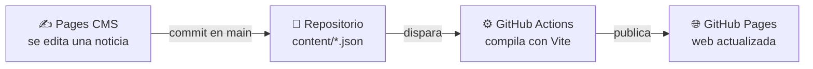

<p align="center">
  
</p>

<h3 align="center">Tu portal vecinal</h3>

<p align="center">
  Noticias, negocios, servicios y un tablón para compartir<br>
  lo que pasa en Venialbo (Zamora).
</p>

<p align="center">
  <a href="https://venialboconecta.es"></a>
  &nbsp;
  <a href="https://github.com/pueblosconectados/venialbo-conecta/actions/workflows/web-static-pages.yml"></a>
</p>

---

## Qué es

**VenialboConecta** es la web del pueblo: un sitio sencillo donde cualquier
vecino puede enterarse de lo que pasa, encontrar un negocio o saber cuándo pasa
el bibliobús, sin registrarse ni instalar nada.

|    | Sección | Qué encontrarás |
|----|---------|-----------------|
| 📰 | **Noticias** | Lo último que pasa en el pueblo, en 11 categorías: fiestas, obras, avisos urgentes, cultura… |
| 🏪 | **Negocios** | El directorio del comercio local, con contacto y enlaces a sus redes |
| 🏥 | **Servicios** | Médico, comedor, bibliobús y demás servicios, con sus horarios |
| 📌 | **Tablón** | Anuncios entre vecinos: mascotas perdidas, compraventa, objetos perdidos |
| 🤝 | **Pueblos Conectados** | El proyecto del que forma parte esta web |

## Pueblos Conectados


Esta web forma parte de **[Pueblos Conectados](https://venialboconecta.es/pueblos-conectados)**,
un proyecto colaborativo entre las localidades de
[Venialbo](https://es.wikipedia.org/wiki/Venialbo) (Zamora) y
[Aldearrubia](https://es.wikipedia.org/wiki/Aldearrubia) (Salamanca), nacido
dentro del concurso
[InnovaCyL Digital](https://www.cyldigital.es/iniciativas-destacadas/concurso-innovacyl-digital)
de Castilla y León Digital para impulsar el desarrollo local con herramientas
digitales.

> *Nosotros ponemos la red, vosotros ponéis la vida.*

[Instagram](https://www.instagram.com/pueblosconectados.cyldigital) ·
[Facebook](https://www.facebook.com/61594090958025/)

## Cómo funciona

Es una web **estática**: no hay servidor ni base de datos que mantener. Todo el
contenido vive en este repositorio como ficheros JSON, y quien lo redacta no
necesita tocar código.



1. El contenido se edita desde [Pages CMS](https://pagescms.org), con un editor
   visual: negrita, enlaces, listas, imágenes.
2. Cada guardado es un commit en `main`.
3. Una GitHub Action compila la web y la publica. En uno o dos minutos está en
   línea.

## Estructura del repositorio

```
venialbo-conecta/
├── web-static/       ← la web publicada (React + Vite + Ant Design)
│   ├── content/      ← noticias, negocios, servicios… en JSON; lo que edita Pages CMS
│   ├── public/       ← imágenes y logos que se sirven tal cual
│   └── src/          ← el código de la web
├── assets-src/       ← originales de los logos y el script que los genera
├── tally/            ← los formularios: sus definiciones y los scripts que los crean
└── .pages.yml        ← configuración de Pages CMS: qué campos tiene cada sección
```

## Lo que ya no está aquí

El proyecto empezó como app Android con backend propio. Hoy el producto es
`web-static/`: más barato de mantener y sin servidores, así que en septiembre de
2026 el resto salió de `main` para dejar a la vista solo lo que se usa.

No se ha borrado nada: está completo, con su historial, en la etiqueta
[`archivo-app-backend-2026-09`](https://github.com/pueblosconectados/venialbo-conecta/tree/archivo-app-backend-2026-09).

| Qué era | Último cambio |
| --- | --- |
| `android/` — app en Kotlin + Jetpack Compose, fases 1 a 8 | abril de 2026 |
| `backend/` — API en FastAPI + SQLAlchemy | junio de 2026 |
| `web/` — frontend con Refine sobre ese backend | junio de 2026 |

Para recuperar cualquiera de ellos:

```bash
git checkout archivo-app-backend-2026-09 -- android/
```

## Colores

Los tres colores de marca están muestreados del logo, para que la web y la
imagen del pueblo casen.


El verde sale del rótulo *VENIALBO*, el dorado de *CONECTA* y la terracota es la
media del degradado de la casa. Están en
[`web-static/src/theme.ts`](web-static/src/theme.ts).

## Desarrollo local

```bash
cd web-static
npm install
npm run dev
```

Más detalle —compilar, previsualizar, publicar con otro dominio— en
[`web-static/README.md`](web-static/README.md). Para regenerar los logos y el
favicon, ver [`assets-src/README.md`](assets-src/README.md).

---

<p align="center">
  <sub>Hecho con cariño para Venialbo</sub>
</p>
